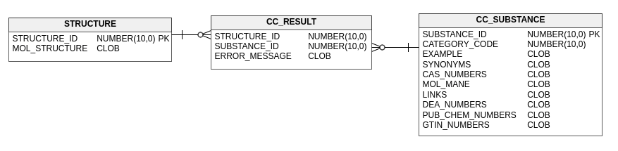

# Compliance Checker Integration API Usage Example

## Introduction
This project is a Java SpringBoot application example on how to use [ChemAxon Compliance Checker](https://chemaxon.com/products/compliance-checker) integration API to regularly check big amount of structures read from a relational database and write the results back.

## Data model

* Table STRUCTURE: Contains molecules with unique ids to be checked.
* Table CC_SUBSTANCES: All substance data from Compliance Checker.
* Table CC_RESULT: Join table that contains the relation between structures and substances or error message in case checking has failed for a structure.

## Workflow
1. The process starts periodically by the configured scheduler 
2. The rows from table CC_RESULT are deleted
3. The rows from table CC_SUBSTANCE are deleted
4. Up to date substance data retrieved from Compliance Checker is inserted into the table CC_SUBSTANCE
5. Content of table STRUCTURE is fetched and sent to Compliance Checker's check-with-id endpoint.
6. Based on the response (in case of hit or error) rows are inserted into table CC_RESULT

## Prerequisites
* JDK8 or higher installed
* Oracle database with tables described above. (Table STRUCTURE might not be needed see 'Notes' section)
* ChemAxon Compliance Checker services installed and running (for help, please refer to our [documentation](https://docs.chemaxon.com/display/docs/Compliance+Checker)):
    * cc-backend
    * cc-bigdata
    * cc-api
    * cc-config
    * cc-eureka
    
## Run application from IDE
1. Import the project into your favorite IDE as a gradle project
2. Create folder named 'config' next to folder 'config-example'
3. Copy the content of 'config-example' into this folder
4. Configure application by setting properties in the application.properties and bootstrap.properties files.
5. Run class CcApiClientApplication.

## How to build
1. Clone the repository
2. [Download](https://www.oracle.com/technetwork/database/features/jdbc/default-2280470.html) Oracle JDBC driver (v12.1.0.2)
3. Install the driver into your local maven repository with the following command:<br>
```
>mvn install:install-file -Dfile={Path/to/your/ojdbc7.jar} -DgroupId=com.oracle -DartifactId=ojdbc7 -Dversion=12.1.0.2 -Dpackaging=jar
```
4. Build the jar file:<br>
```
>./gradlew ccbootjar
```

## Usage
After building the application.
1. Copy the content of the build/libs folder to the desired location
2. Configure application by setting properties in the application.properties and bootstrap.properties files under config folder. See instructions in files.
3. Run the application<br>
```
>java -jar cc-api-client-1.0.0.jar
```

## Customization
In case you need to customize the application to meet your needs. For example you want to write back the results to the database in a different way or you want to do something completely different with the results, you probably only need to replace the implementation of the ResultService and InitializerService interfaces.

## Notes
* To have a STRUCTURE table in your database is not mandatory. An sql query should be set in the application.properties file that returns all the structures with their ids you want to check. It does not matter what table/tables those records come from.
* Application can work with any kind of relational database with the appropriate JDBC driver. The driver has to be added to the application and configuration has to be done accordingly (see application.properties). Be aware that different databases might use different SQL dialects so changing query strings in the code might also be needed.
